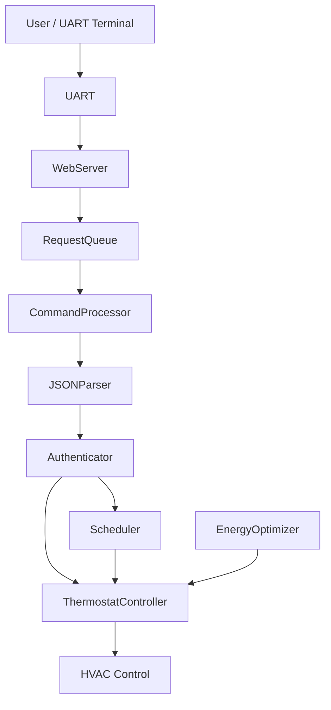
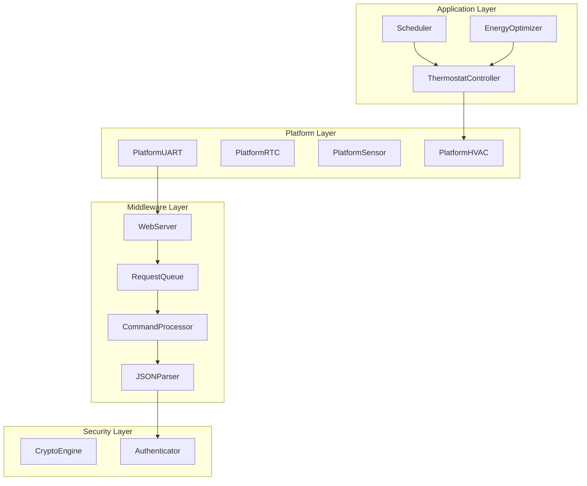
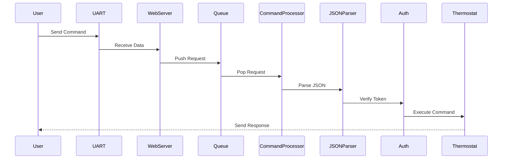
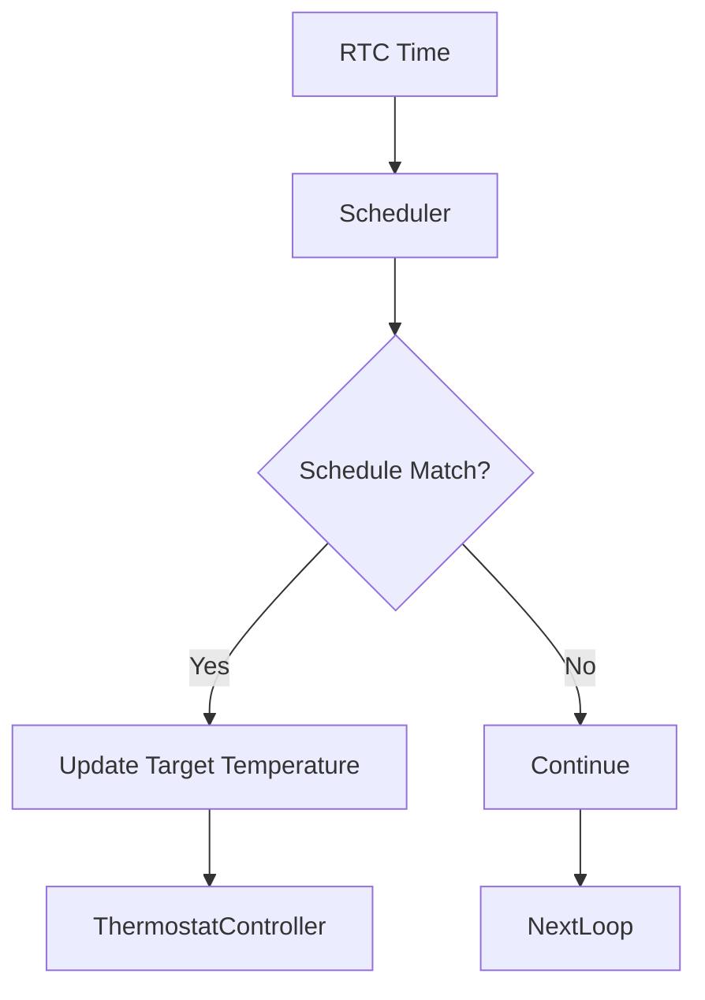
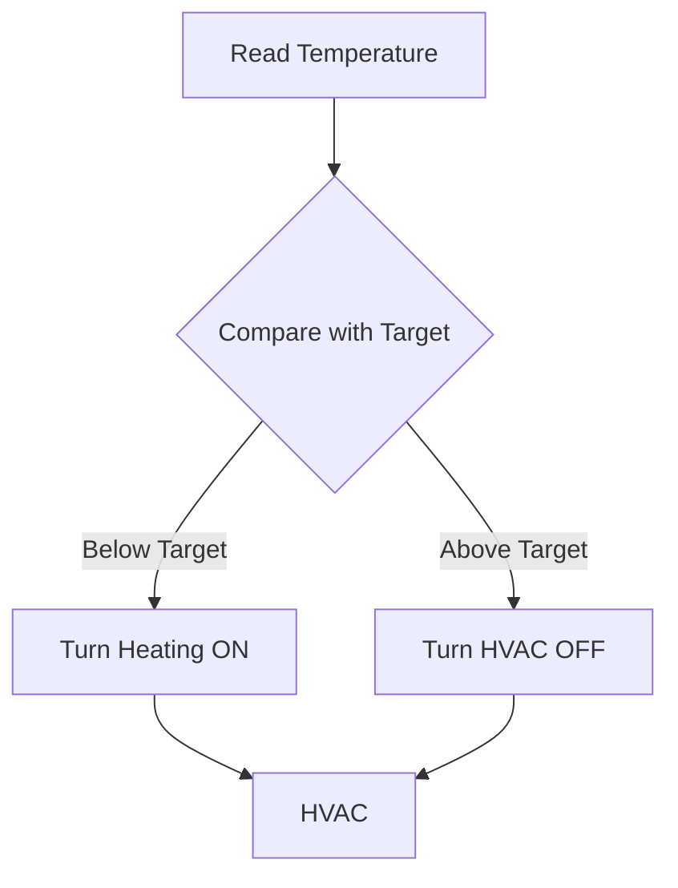
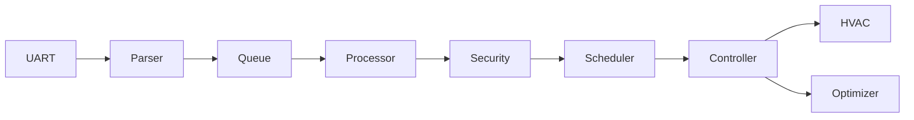
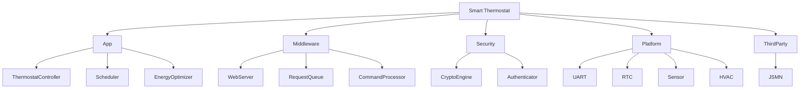

### Project Overview
This project implements a smart thermostat firmware running on STM32.  
It enables remote temperature control via UART using an HTTP-like protocol.

Key capabilities include:

- Remote command execution using structured requests
- Secure communication using encryption and authentication
- Time-based scheduling using RTC
- Adaptive energy optimization based on usage patterns
- Modular embedded architecture for scalability

## System Architecture

### Firmware Layer Architecture

### Command Processing Flow

### Scheduler Runtime Logic

### Thermostat Control Logic

### Full System Data Flow

### Folder Structure Diagram

