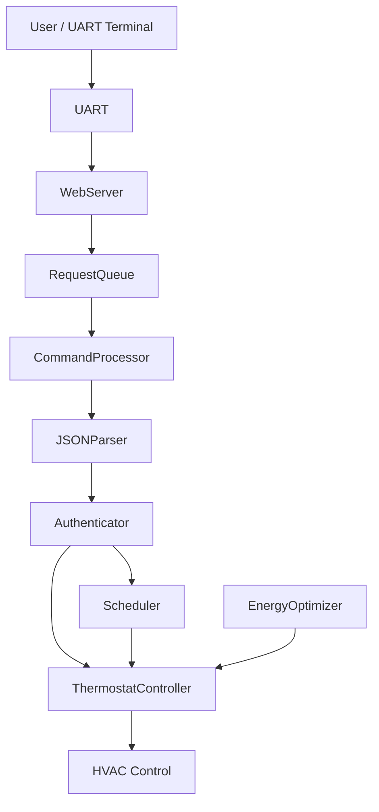
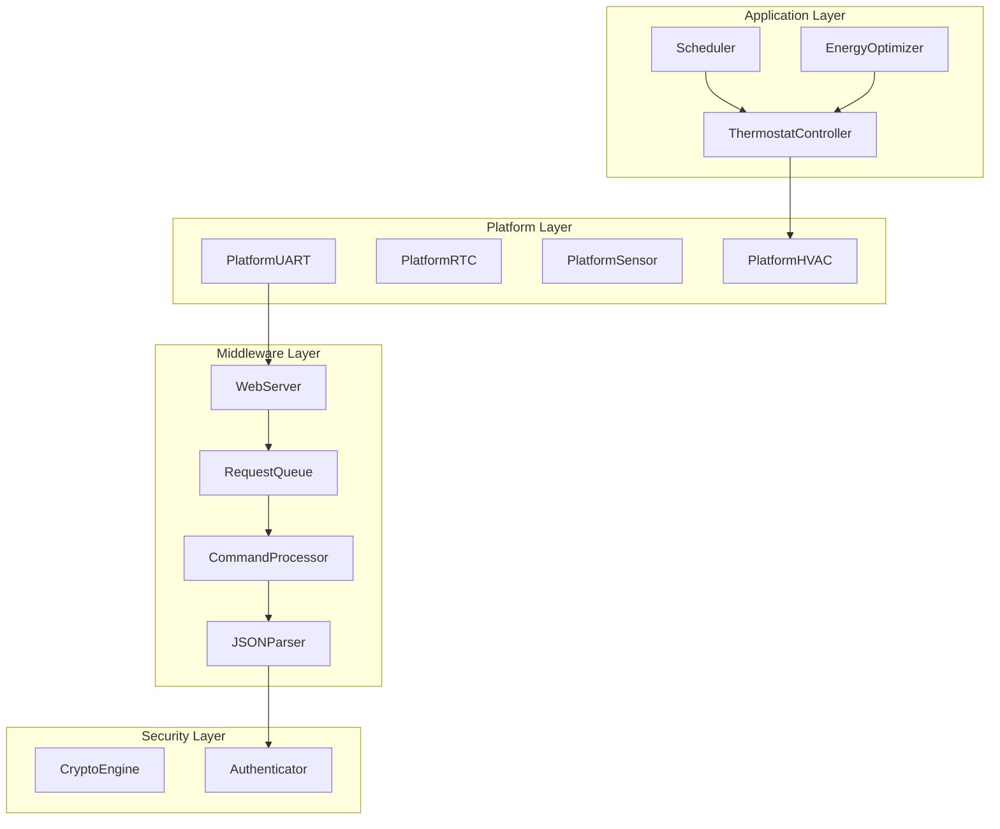
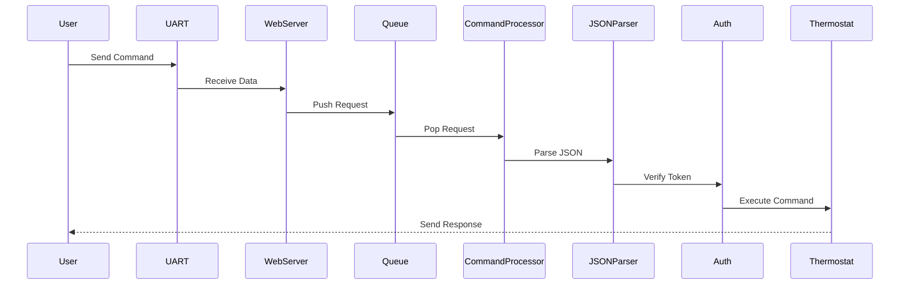
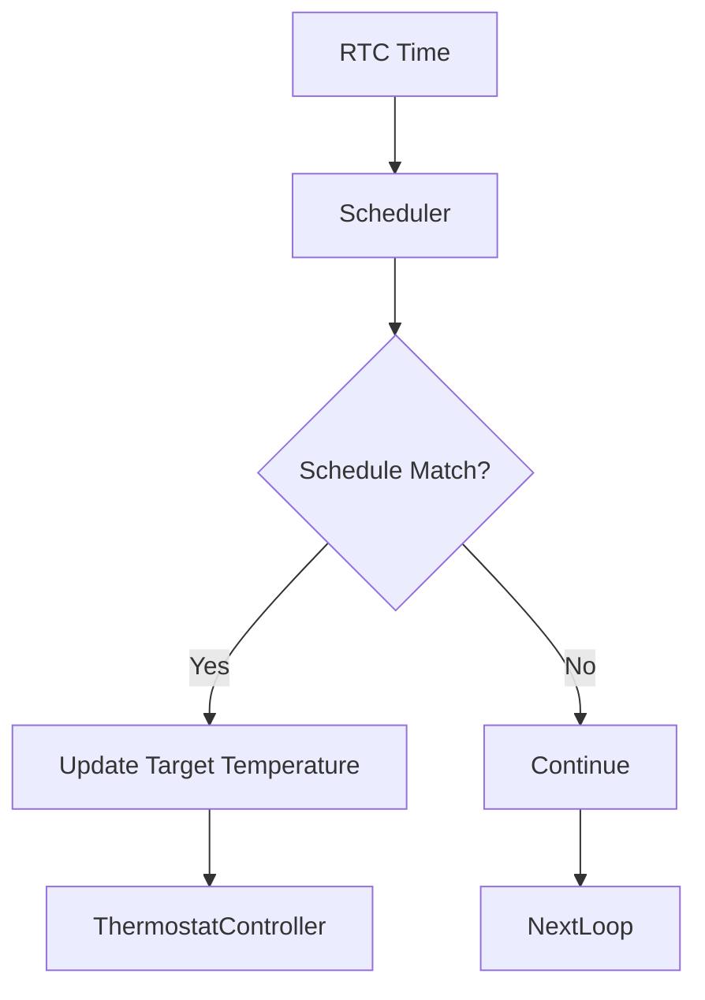
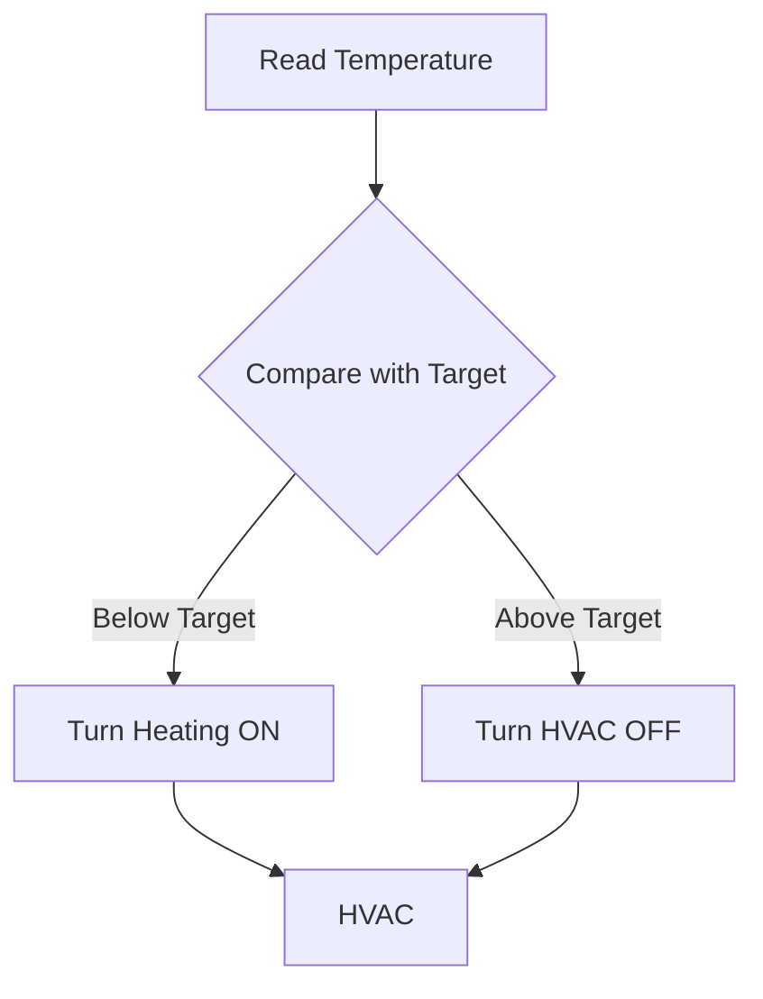
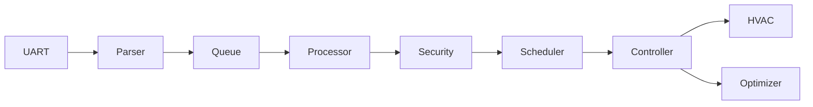
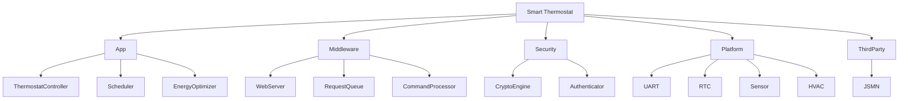

### Project Overview
This project implements a smart thermostat firmware running on STM32.  
It enables remote temperature control via UART using an HTTP-like protocol.

Key capabilities include:

- Remote command execution using structured requests
- Secure communication using encryption and authentication
- Time-based scheduling using RTC
- Adaptive energy optimization based on usage patterns
- Modular embedded architecture for scalability

### System Architecture Diagram

This diagram shows the end-to-end flow of data through the system.

- User sends commands via UART interface
- WebServer parses incoming data into structured requests
- Requests are stored in a queue for controlled processing
- Command Processor interprets commands and triggers actions
- JSON Parser extracts data from payloads
- Authentication ensures only authorized commands are executed
- Scheduler and Thermostat Controller manage temperature logic
- Energy Optimizer improves efficiency based on usage patterns
- Final output controls the HVAC system

### Layer Architecture
The firmware is divided into logical layers to improve modularity and maintainability.

- Application Layer: Core system logic (thermostat, scheduler, optimization)
- Middleware Layer: Handles communication and data processing
- Security Layer: Provides encryption and authentication
- Platform Layer: Interfaces with hardware peripherals

Each layer has a clear responsibility and minimal coupling with others.

### Command Processing Flow
This sequence diagram illustrates how a command is processed:

- User sends a command through UART
- WebServer receives and parses the request
- Request is pushed into a queue
- Command Processor retrieves the request
- JSON Parser extracts command parameters
- Authentication verifies access permissions
- Valid commands are executed by the thermostat system
- Response is sent back to the user

This flow ensures structured and secure command handling.

### Scheduler Logic

The scheduler manages time-based temperature control using RTC.

- RTC provides current system time
- Scheduler checks if a schedule entry matches current time
- If a match is found, target temperature is updated
- Scheduler avoids repeated triggers within the same minute
- Ensures automated temperature control throughout the day

This enables energy-efficient and user-defined temperature scheduling.

### Thermostat Control Logic

This diagram shows how temperature control decisions are made.

- Current temperature is read from sensor
- Compared with target temperature
- If below target → heating is turned ON
- If above target → HVAC is turned OFF
- Hysteresis is used to avoid frequent ON/OFF switching

This ensures stable and efficient temperature regulation.

### Full System Data Flow

### Folder Structure

The project is organized into modular directories:

- app/: Core application logic (thermostat, scheduler, optimizer)
- middleware/: Communication and request handling
- security/: Encryption and authentication modules
- platform/: Hardware abstraction layer
- third_party/: External libraries (e.g., JSON parser)

This structure ensures clear separation of concerns and easy scalability.

