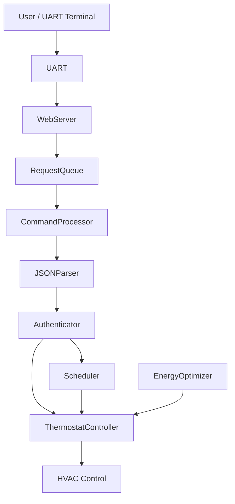
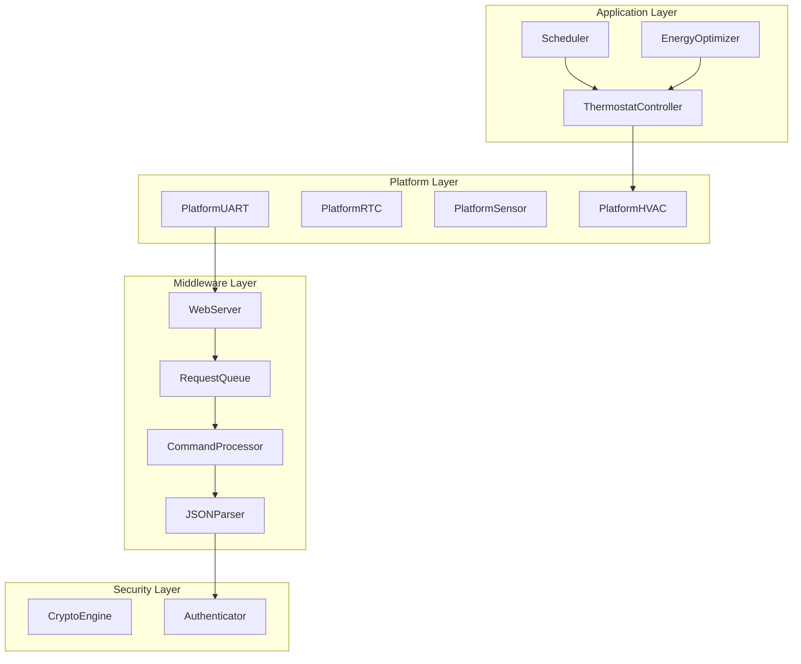

## System Architecture

```mermaid
    flowchart TD

    User[User / UART Terminal]
    
    User --> UART
    
    UART --> WebServer
    
    WebServer --> RequestQueue
    
    RequestQueue --> CommandProcessor
    
    CommandProcessor --> JSONParser
    
    JSONParser --> Authenticator
    
    Authenticator --> Scheduler
    Authenticator --> ThermostatController
    
    Scheduler --> ThermostatController
    
    ThermostatController --> HVAC[HVAC Control]
    
    EnergyOptimizer --> ThermostatController
```

### Firmware Layer Architecture

```mermaid
    flowchart TB
    
    subgraph Application Layer
    ThermostatController
    Scheduler
    EnergyOptimizer
    end
    
    subgraph Middleware Layer
    WebServer
    RequestQueue
    CommandProcessor
    JSONParser
    end
    
    subgraph Security Layer
    CryptoEngine
    Authenticator
    end
    
    subgraph Platform Layer
    PlatformUART
    PlatformRTC
    PlatformSensor
    PlatformHVAC
    end
    
    PlatformUART --> WebServer
    WebServer --> RequestQueue
    RequestQueue --> CommandProcessor
    CommandProcessor --> JSONParser
    JSONParser --> Authenticator
    
    Scheduler --> ThermostatController
    EnergyOptimizer --> ThermostatController
    ThermostatController --> PlatformHVAC
```
